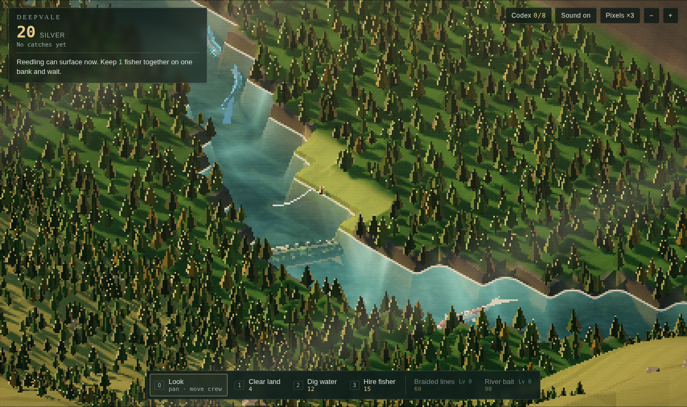

# Deepvale

A cozy idle game about tiny crews, giant fish and river folklore. Far below a vast mountain, a valley river keeps creatures longer than villages. Keep the current running, build a village by the water, send its goods down the river and up the Way, and gather enough gentle hands to meet something vast, and let it go.



Built for the browser with [three.js](https://threejs.org): low-poly 3D rendered at low resolution for a pixel-art look, with golden-hour lighting, rim light and caustics on the riverbed.

## Run it

```bash
npm install
npm run dev        # local dev server with hot reload
npm run build      # production build in dist/
npm run preview    # serve the production build
```

In dev builds, press `` ` `` (or F9) for the debug panel: time ×1–16, fish frenzy, resources, crates, unlocks, secrets and more. Add `?debug` to the address to get it in a production build. `window.__dv` also exposes game state (for example `__dv.spawnFish(__dv.SP.warden, __dv.comps()[0])`).

## Publish

- **itch.io:** `npm run package:itch` writes `release/deepvale-itch-v<version>.zip`. Upload it as an HTML project and tick "This file will be played in the browser".
- **GitHub Pages:** every push to `main` builds and deploys through `.github/workflows/deploy.yml`. Enable it once under Settings → Pages → Source: GitHub Actions.

## Project layout

```
index.html            HUD markup and page shell
src/
  main.js             the list of game parts, in the order they run
  game/core/          setup.js (imports, state, renderer, day clock, `PACING`: the valley's timers), save.js (save, load, migration), boot.js (menus, tour, main loop)
  game/world/         terrain.js (ground, water surface, trees, flow analysis), nature.js (seasons, weather, wildlife, giants)
  game/fish/          fish.js (fish, fishers, sparkles), hooking.js (bites, the fight, release tally, spawning)
  game/economy/       rules.js (costs, actions, production, health, pilgrims), trade-secrets.js, crates.js (keepers, blessings, wishes)
  game/village/       village.js (workers, corner and edge decor, building plots)
  game/ui/            view.js (camera, post pipeline), input.js, hud.js (labels, rings, drawer, ledger), letter.js (the letter from the village when you come back), tapestry.js (threads and the tapestry at the Tale House), debug.js
  style.css           HUD styling
  core/utils.js       math, noise and localStorage helpers
  world/constants.js  valley grid, tile types, river course
  world/flow.js       river current solver (flowing vs still water)
  data/species.js     the eight fish and their unlock gates
  data/lore.js        rumors, tales, village names, map regions
  data/builds.js      buildings, goods, hut styles, paving, keepers, blessings, named places, orders
  world/secrets.js    what is hidden in the forest, placed from the save's seed
  game/trade.js       wagons, barges, routes, selling and orders
  render/village.js   huts, bridges, every other building, and pilgrims
  render/props.js     meshes for buildings, decor, wagons, barges and birds
  ui/tally.js         the release tally
  render/wisps.js     steam and chimney smoke
  ui/map.js           the river map overlay
  render/shaders.js   GLSL chunks (noise, caustics, rim light, fish swim bend)
  audio/audio.js      procedural ambience and sound effects
scripts/              release helpers
docs/DESIGN.md        game design notes, economy and roadmap
```

The game code is split by topic under `src/game/`. The parts share one scope, as the single `main.js` used to: `vite.config.js` joins them back together in the order `src/main.js` lists, so a name defined in one part can be used from any other. Errors and breakpoints point at the part they come from. Editing a part reloads the page in dev.

The production build is byte-for-byte the same as it was before the split. The next step, whenever it's useful, is to turn individual parts into real modules with their own imports and exports, one at a time.

## Controls

| Input | Action |
| --- | --- |
| Drag / WASD | Pan |
| Scroll / pinch / + − | Zoom |
| Q | Look (hover a fish for its card, click to follow it; click a fisher, then a bank tile or bridge, to move them) |
| 1 / 2 / 3 | Clear land / Dig water / Hire fisher |
| 4 / 5 / 6 | Hut / Road / Bridge |
| B | Build drawer (work, fishing, decor, styles & paths, named places) |
| X | Remove (half back) |
| T | Trade: goods, keep-back amounts, wagons & barges, orders |
| Drag | With road, paving, fence, flowers or remove: paint a line |
| C | Codex |
| M | Map of the river |
| ` / F9 | Debug panel (dev builds, or `?debug`) |
